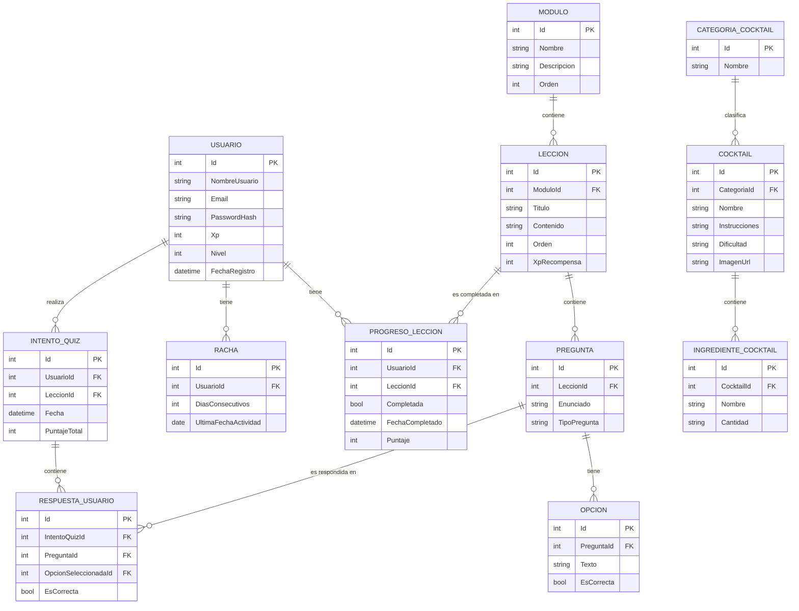

# Diseño de base de datos

## Diagrama Entidad-Relación

## Notas sobre el diseño

**Usuario**
Guarda XP y Nivel desnormalizados (en vez de calcularlos siempre desde Progreso) por performance: se consultan en cada request para el ranking y el dashboard, así que conviene tenerlos ya calculados y actualizarlos cuando el usuario completa una lección.

**Lección vs Pregunta vs Opción**
Una lección tiene contenido teórico (`Contenido`, texto/markdown) y un quiz asociado. Cada pregunta tiene múltiples opciones, una sola marcada como correcta (`EsCorrecta`). Esto permite preguntas de opción múltiple; si más adelante queremos otros tipos (verdadero/falso, completar), el campo `TipoPregunta` ya deja la puerta abierta.

**Progreso vs Intento**
Separamos `ProgresoLeccion` (el estado final: ¿está completada, qué puntaje sacó la última vez?) de `IntentoQuiz` (el historial de cada vez que el usuario rindió el quiz). Esto permite mostrar "mejor puntaje" y también "historial de intentos" sin duplicar lógica.

**Racha**
Se recalcula en el backend cada vez que el usuario completa una lección: si `UltimaFechaActividad` fue ayer, se suma 1 a `DiasConsecutivos`; si fue hoy, no cambia; si fue antes de ayer, se resetea a 1.

**Cocktail**
Por ahora es de solo lectura (contenido curado por nosotros), no hay relación con Usuario todavía. Se podría agregar más adelante una tabla `Favorito` (Usuario-Cocktail) si queremos que los usuarios guarden recetas favoritas.

## Decisiones pendientes / a revisar en Sprint 1

- [ ] ¿`TipoPregunta` es un enum en C# o una tabla separada? → Por simplicidad, arrancamos con enum.
- [ ] ¿Los índices en `Email` y `NombreUsuario` deben ser únicos? → Sí, se define en la configuración de EF Core.
- [ ] ¿Soft delete o delete físico? → A definir cuando implementemos el CRUD de usuarios.
